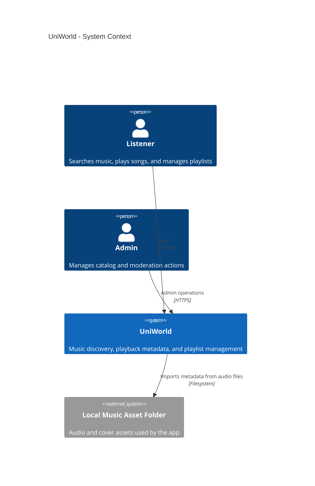
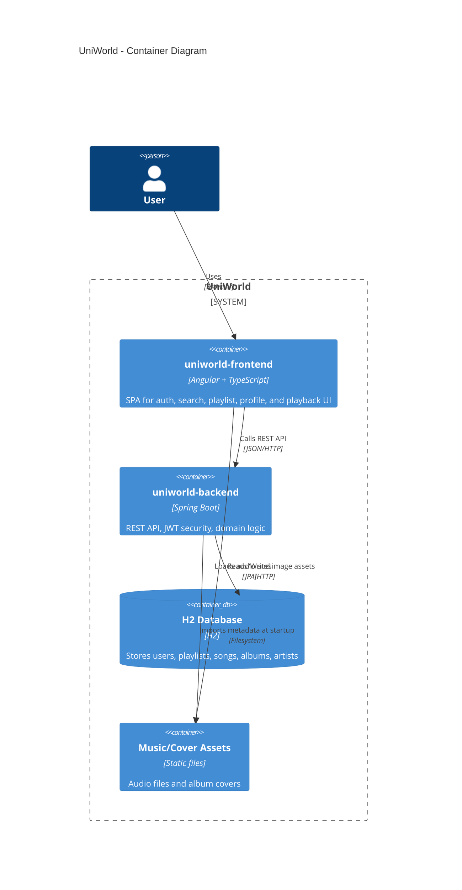
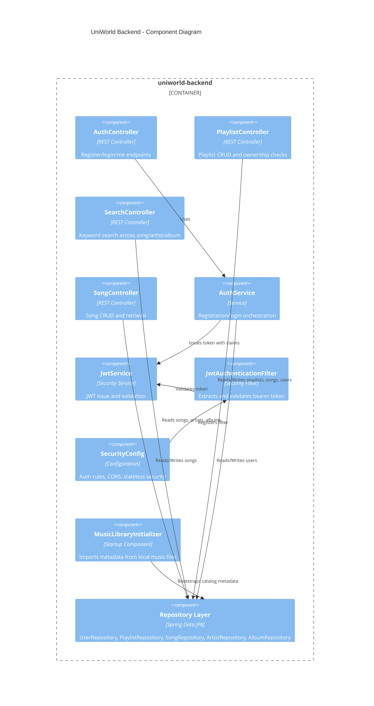
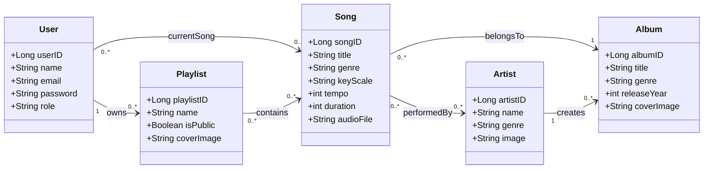
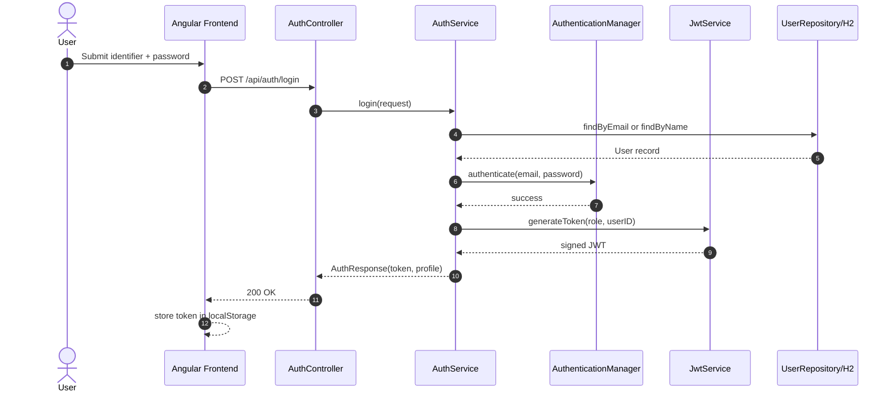
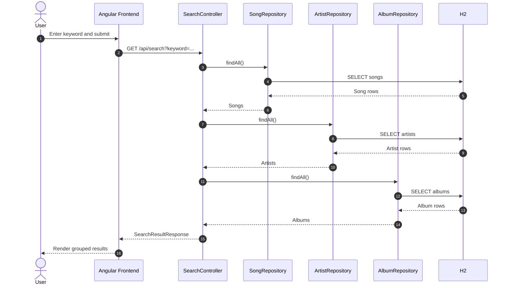
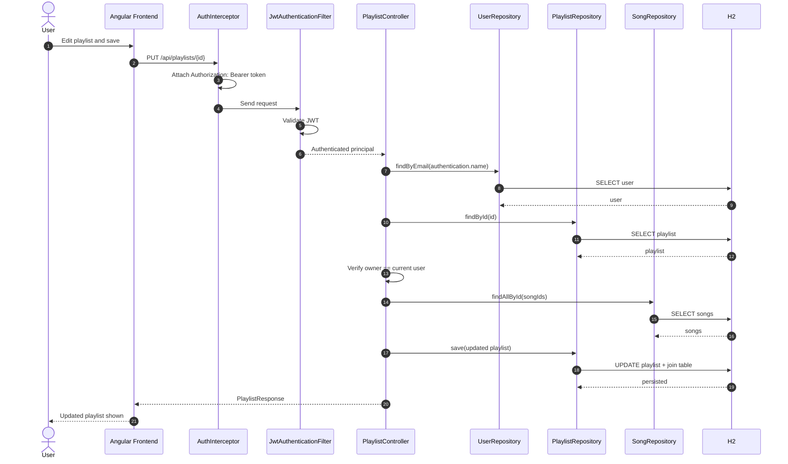
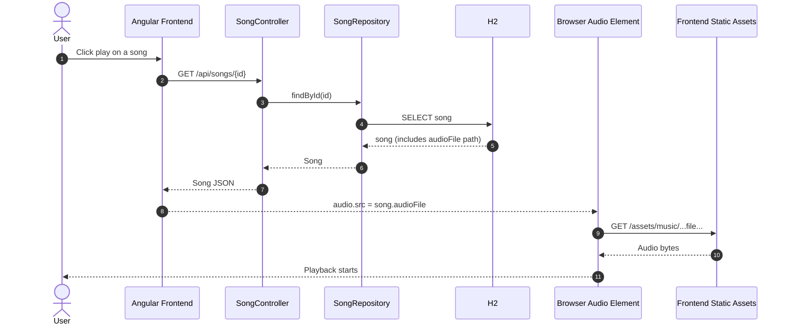

# UniWorld Architecture

## Vision Statement
For music listeners who want an accessible and customizable online music experience, UniWorld, is a web-based music streaming service that provides instant music playback, playlist management, song search that leads to the discovery of new music. Unlike large commercial streaming services, this product delivers a seamless and personalized, and enjoyable music listening experience to users.

## User Stories
As a new user, I want to register with email and password so that I can create a music account.

As a registered user, I want to log in securely so that I can access my music account.

As a user, I want o browse songs by title, artist, or album so that I can discover new music.

As a user, I want to play a song instantly so that I can listen to it without downloading.

As a user, I want to create a playlist so that can organize my favorite songs.

As a user, I want add or remove songs from my playlist so that I can manage my music collection.

## 1. System Overview
UniWorld is a full-stack music web application composed of:
- Angular frontend (`uniworld-frontend`) for UI, routing, playback controls, and API integration.
- Spring Boot backend (`uniworld-backend`) for authentication, authorization, search, and music domain CRUD APIs.
- H2 in-memory database for users, playlists, songs, albums, and artists.

## 2. Technology Stack
- Frontend: Angular 20, TypeScript, RxJS
- Backend: Java 21, Spring Boot 4, Spring Security (JWT), Spring Data JPA
- Database: H2 (in-memory)
- Auth: JWT Bearer tokens
- Media metadata ingestion: mp3agic (startup music import)

## 3. C4 Model

### 3.1 C4 Context Diagram

### 3.2 C4 Container Diagram

### 3.3 C4 Component Diagram (Backend)

## 4. Domain Class Diagram

## 5. Sequence Diagrams

### 5.1 User Login Flow

### 5.2 Search Flow

### 5.3 Playlist Update with Authorization

### 5.4 Song Playback Metadata Flow

## 6. Key Architectural Decisions
- Stateless authentication with JWT; frontend stores token and sends it through an interceptor.
- Global security policy requires authentication for all API routes except auth, error, and H2 console.
- Catalog bootstrap imports and updates song metadata from local audio assets at backend startup.
- Playlists are ownership-protected at the controller level (only owner can update/delete).
- Search currently performs in-memory filtering over repository data (`findAll()` then filter in Java).

## 7. Challenges Faced
- H2 is in-memory and reset-prone, which made it harder to keep test data stable across runs.
- Search relied on in-memory filtering over repository data, so performance and scalability became a concern as the catalog grew.
- Serving audio and cover assets directly was straightforward for development, but it introduced production deployment concerns.
- Authorization checks were handled in controllers, which made security logic more repetitive and harder to centralize.
- Importing music metadata at startup introduced edge cases around missing tags, invalid file formats, and cover-image fallback handling.

## 8. Pairwise Testing Plan

Pairwise testing complements MC/DC coverage by testing interactions between available inputs in current code paths.

### 8.1 Test Domains with Available Pairwise Factors

#### Authentication
Available factors: endpoint (`/register`, `/login`, `/me`) x identifier type (email, username) x password state (valid, blank, wrong) x authentication presence (present, missing)
Example:

| Endpoint | Identifier | Password | Authentication | Expected Result |
|---|---|---|---|---|
| `/api/auth/register` | email | valid | missing | PASS (creates user) |
| `/api/auth/register` | email | blank | missing | FAIL 400 |
| `/api/auth/login` | username | valid | missing | PASS (token returned) |
| `/api/auth/login` | username | wrong | missing | FAIL 401 |
| `/api/auth/me` | n/a | n/a | present | PASS (current user) |
| `/api/auth/me` | n/a | n/a | missing | FAIL 401 |

#### Playlist Management
Available factors: caller relationship (owner, non-owner, unauthenticated) x operation (`create`, `update`, `delete`) x `songIds` state (valid, empty, invalid) x `isPublic` value (true, false, null)
#### Example:

| Caller | Operation | `songIds` | `isPublic` | Expected Result |
|---|---|---|---|---|
| owner | create | valid | true | PASS 201 |
| owner | create | empty | null | PASS 201 (defaults public) |
| owner | update | invalid | false | FAIL 400 |
| non-owner | update | valid | true | FAIL 403 |
| owner | delete | empty | n/a | PASS 204 |
| unauthenticated | delete | n/a | n/a | FAIL 401 |

#### Search and Discovery
Available factors: keyword validity (valid, blank) x keyword pattern (exact, partial, special chars, unicode) x expected match bucket (songs, artists, albums, none)
#### Example:

| Keyword | Pattern | Expected Bucket | Expected Result |
|---|---|---|---|
| `jazz` | exact | songs | PASS (songs list non-empty) |
| `art` | partial | artists | PASS (artist match) |
| `rock` | exact | albums | PASS (album match) |
| `@@@` | special chars | none | PASS (empty lists) |
| `cafe` | unicode/locale variant | songs or artists | PASS (if data exists) |
| `` | blank | n/a | FAIL 400 |

#### Playback and Player
Available factors: queue size (empty, single, multiple) x repeat mode (`off`, `all`, `one`) x shuffle (`on`, `off`) x action (`nextSong`, `previousSong`, `onAudioEnded`, `onSeek`)
#### Example:

| Queue | Repeat | Shuffle | Action | Expected Result |
|---|---|---|---|---|
| empty | off | off | `nextSong` | PASS (no-op) |
| single | one | off | `onAudioEnded` | PASS (restarts current song) |
| single | off | off | `onAudioEnded` | PASS (stops at end) |
| multiple | off | off | `nextSong` | PASS (moves to next index) |
| multiple | all | on | `previousSong` | PASS (selects valid random/prev index) |
| multiple | off | off | `onSeek` | PASS (updates current time) |

### 8.2 Benefits

This version uses only factors that map directly to existing controller methods and player component methods, avoiding unimplemented dimensions such as server-side search filters or sort parameters.

### 8.3 Implementation

Generate pairwise cases from the available factors with PICT, then run them as parameterized tests in JUnit 5 (`AuthService`, `PlaylistController`, `SearchController`) and Jasmine (`Player`).
